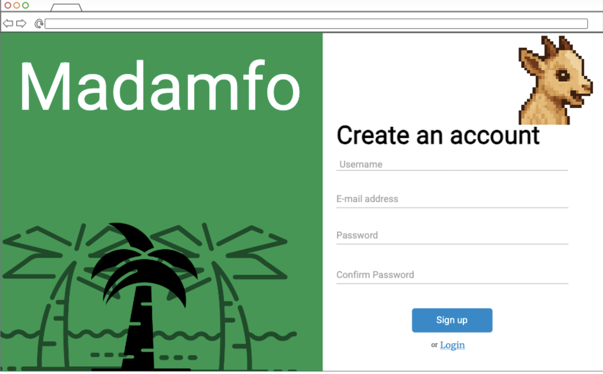
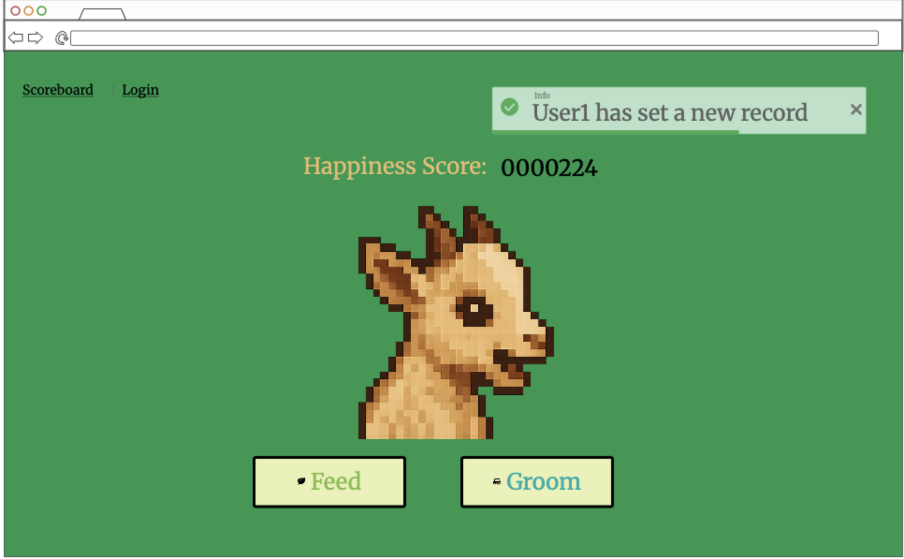
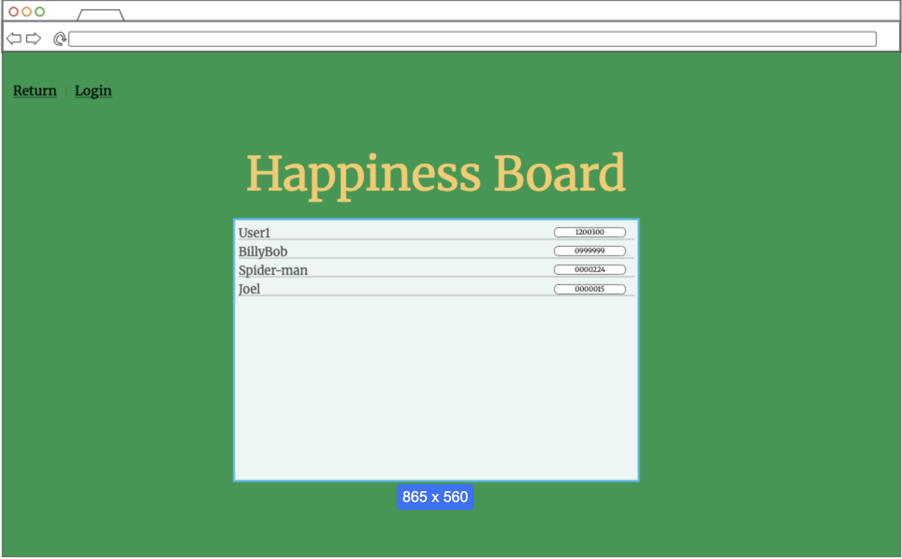

# virtual-spider
A repository for Logan Smith in the class C S 260 for use in a startup application.

# Specifcation Deliverable
### Elevator Pitch

Everyone loves games about taking care of pets. From tamagotchi to wii petz, you want to take care of adorable creatures and animals. But what I bring to you is a mix of game and culture experience. Experience ghanain culture all while taking care of an adorable goat in this one of a kind game. You will be able to compare your scores with other players, racing to see who can have the happiest goat.

### Design

### Key features

- Secure login over HTTPS
- Option to feed the goat
- Option to groom the goat
- Notification when the high score is beat
- Totals from all users displayed in realtime
- A goat that speaks motivational quotes
- Animated goat

### Technologies

I am going to use the required technologies in the following ways:

- **HTML** - Uses correct HTML structure for application. Three HTML pages. One for login and one for the game and one for the scoreboard. Hyperlinks to choice artifact.
- **CSS** - Application styling that looks good on different screen sizes, uses good whitespace, color choice and contrast.
- **React** - Provides login and interactive points for the game. Button functions and score calculations based on user input. Including visual outputs for the user.
- **Service** - Backend service with endpoints for:
  - Register, login, and logout users.
  - storing scores
  - Pulling a random motivation quote from a TPD api
- **DB/Login** - Store users and scores in a database. Register and login users. Credentials securely stored in database.
- **WebSocket** - Users who beat the highscore will be broadcasted among all players.

## HTML deliverable

For this deliverable I built out the structure of my application using HTML.

- [] **HTML pages** - Three HTML page that represent the ability to login, play the game, and display highscores
- [x] **Links** - The login page automatically links to the game page. The menu in the navigation will link to each page.
- [x] **3rd party API placeholder** - Goat will speak new quotes when entering the page.
- [x] **Text** - Score page names, quotes, headers will be displayed with text
- [x] **Images** - Pixel art goat image which will represent the game character
- [x] **Login placeholder** - Placeholder for auth on the login page.
- [] **DB data placeholder** - High scores displayed on scores page.
- [x] **WebSocket** - Highscore message would be broadcasted to all clients via the websocket
- [x] **GitHub Page** - Link to my github page
